# WordFigures

WordFigures symbolizes the transformation of simple text into structured and advanced language models (LLMs), reflecting the art of shaping language as it evolves from basic to complex forms.

This repository takes you on a structured journey through Natural Language Processing (NLP) and Large Language Models (LLMs). It starts with fundamental text preprocessing techniques and gradually builds up to advanced deep learning models.

The project is organized into several notebooks, each dedicated to a specific topic or technique, making it easy to follow and learn. Whether you're a beginner or looking to deepen your understanding, WordFigures provides a step-by-step guide to mastering NLP and LLMs.

## Contents
- [WordFigures](#wordfigures)
  - [Contents](#contents)
    - [Part 1: Text Processing and Word Representations](#part-1-text-processing-and-word-representations)
      - [**wordFigures\_part\_1a\_TextProcessing.ipynb**](#wordfigures_part_1a_textprocessingipynb)
      - [**wordFigures\_part\_1b\_Word\_embedding.ipynb**](#wordfigures_part_1b_word_embeddingipynb)
      - [**wordFigures\_part\_1c\_word2vec.ipynb**](#wordfigures_part_1c_word2vecipynb)
    - [Part 2: NLP Applications](#part-2-nlp-applications)
      - [**wordFigures\_part\_2a\_Sentiment\_Analysis.ipynb**](#wordfigures_part_2a_sentiment_analysisipynb)
      - [**wordFigures\_part\_2b\_FakeNewsClassifierusingLSTM.ipynb**](#wordfigures_part_2b_fakenewsclassifierusinglstmipynb)
    - [Part 3: Transformer Models and Fine-Tuning](#part-3-transformer-models-and-fine-tuning)
    - [Transformer :huggingface.co/docs/transformers/](#transformer-huggingfacecodocstransformers)
      - [**wordFigures\_part\_3a\_BERT.ipynb**](#wordfigures_part_3a_bertipynb)
      - [**wordFigures\_part\_3b\_BERT\_Fine\_Tuning.ipynb**](#wordfigures_part_3b_bert_fine_tuningipynb)
  - [Part 4: LLM, GPT](#part-4-llm-gpt)
  - [Inspirations](#inspirations)

### Part 1: Text Processing and Word Representations

* **Text Preprocessing**: Cleaning, tokenization, stemming, lemmatization, stop word removal, spell checking, etc.
* **Text Representation**: Bag-of-words, TF-IDF, word embeddings (Word2Vec, GloVe), contextual embeddings (BERT, ELMO), etc.
* **Syntax and Grammar**: Parsing, part-of-speech tagging, syntactic analysis, dependency parsing, constituency parsing, etc.
* **Semantics**: Named entity recognition, semantic role labeling, word sense disambiguation, semantic similarity, etc.

#### **[wordFigures_part_1a_TextProcessing.ipynb](#)**
- **Description**: Demonstrates basic NLP techniques to preprocess and clean text data.
- **Techniques Covered**:
  1. Tokenization
  2. Stemming
  3. Lemmatization
  4. Removing Stopwords
  5. Bag of Words
  6. TF-IDF
- **Purpose**: Lays the foundation for text data preprocessing, transforming raw text into structured input for further analysis.

#### **[wordFigures_part_1b_Word_embedding.ipynb](#)**
- **Description**: Explores word embedding techniques to convert text into numerical vectors, preserving semantic relationships.
- **Topics Covered**:
  - Overview of word embedding methods
  - Implementation of embeddings using pre-trained models (e.g., GloVe, FastText).
- **Purpose**: Introduces the concept of distributed word representations for improving NLP tasks.
- **Reference**: 
   - [neural-probabilistic-lang-model-bengi003a.pdf](#)
   - https://www.kaggle.com/datasets/lakshmi25npathi/imdb-dataset-of-50k-movie-reviews

#### **[wordFigures_part_1c_word2vec.ipynb](#)**
- **Description**: Demonstrates the Word2Vec model for learning word embeddings.
- **Key Features**:
  - Skip-gram and CBOW architectures
  - Training a Word2Vec model on sample text
  - Visualizing word relationships using t-SNE
- **Purpose**: Explains how Word2Vec captures contextual relationships in text data.
- **Reference**: [neural-probabilistic-lang-model-bengi003a.pdf](#)

### Part 2: NLP Applications

* **Text Classification**: Sentiment analysis, topic modeling, document categorization, spam detection, intent recognition, etc.
* **Information Extraction**: Named entity extraction, relation extraction, event extraction, entity linking, etc.
* **Machine Translation**: Neural machine translation, statistical machine translation, alignment models, sequence-to-sequence models, etc.
* **Question Answering**: Document-based QA, knowledge-based QA, open-domain QA, reading comprehension, etc.
* **Text Generation**: Language modeling, text summarization, dialogue systems, chatbots, text completion, etc.
* **Text Mining and Analytics**: Topic extraction, sentiment analysis, trend detection, text clustering, opinion mining, etc.

#### **[wordFigures_part_2a_Sentiment_Analysis.ipynb](#)**
- **Description**: Implements sentiment analysis using Transformer-based models.
- **Techniques Covered**:
  - `TFDistilBertForSequenceClassification`
  - Fine-tuning with `TFTrainer` and `TFTrainingArguments`
- **Purpose**: Demonstrates how to classify text data into sentiment categories using state-of-the-art Transformer architectures.

#### **[wordFigures_part_2b_FakeNewsClassifierusingLSTM.ipynb](#)**
- **Description**: Builds a Fake News Classifier using an LSTM-based deep learning model.
- **Key Features**:
  - Text preprocessing for fake news detection
  - LSTM architecture for sequence modeling
- **Purpose**: Highlights the application of recurrent neural networks for sequence classification tasks.
- **Reference**: 
   * [LSTM-generating-sequences-RNN.pdf](#)
   * [Understanding LSTM Networks](https://colah.github.io/posts/2015-08-Understanding-LSTMs/)
   - 
   - 

### Part 3: Transformer Models and Fine-Tuning

*  **Transformer model** introduced in the paper "Attention is All You Need" by Vaswani et al. (2017), is a groundbreaking neural network architecture that has become the foundation of modern Natural Language Processing (NLP) and many advancements in Artificial Intelligence (AI).
* **Model Fine-tuning:** If the performance of the model is not satisfactory, consider refining the model architecture, adjusting hyperparameters, or applying techniques such as regularization to improve performance.

### [Transformer](https://jalammar.github.io/illustrated-transformer/) :huggingface.co/docs/transformers/

-  Step 1: Install Transformer.
-  Step 2: Call the pretrained model.
-  Step 3: Call the tokenizer of that particular pretrained model and encode the text in ex. seq2seq manner.
-  Step 4: Convert these encoding into Dataset objects. (Different objects of dataset for tensorflow - tensors and pytorch)
-  Step 5:  Translate and decode the elements in batch

#### **[wordFigures_part_3a_BERT.ipynb](#)**
- **Description**: Introduces the BERT model and explains its architecture for solving NLP tasks.
- **Topics Covered**:
  - Tokenization and input preparation for BERT
  - Use of pre-trained BERT for text classification
- **Purpose**: Familiarizes users with BERT and its capabilities in understanding context-rich text.
- **Reference**: 
   - [BERT.pdf](#)
   - [BERT](https://jalammar.github.io/illustrated-bert/): 
   - 
   - [🤗 Transformers Notebooks](https://huggingface.co/docs/transformers/main/en/notebooks)
   - [Tutorials by Hugging face for fine tune, processing, etc](https://huggingface.co/docs/transformers/training)

#### **[wordFigures_part_3b_BERT_Fine_Tuning.ipynb](#)**
- **Description**: Demonstrates fine-tuning BERT for specific NLP applications.
- **Techniques Covered**:
  - Customizing BERT for downstream tasks
  - Training and evaluation of the fine-tuned model
- **Purpose**: Showcases the versatility of BERT for domain-specific applications through transfer learning.
- **Reference**: 
  - [BERT.pdf](#)

##  Part 4: LLM, GPT

1. LLM
2. Framework for  - LangChain, Llamaindex
3. Fine Tune LLM models with larger dataset

## Inspirations 
* https://substack.com/@kartiksinghal/note/c-70239045
* https://www.youtube.com/playlist?list=PLZoTAELRMXVOTsz2jZl2Oq3ntWPoKRKwv
* https://neptune.ai/blog/natural-language-processing-with-hugging-face-and-transformers
* https://neptune.ai/blog/hugging-face-pre-trained-models-find-the-best
* https://www.youtube.com/watch?v=xI0HHN5XKDo